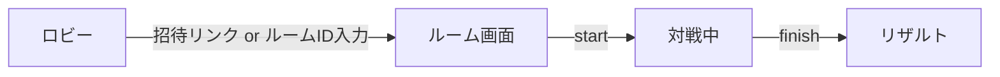

# 画面モック（スクリーンショット）

目的

- デザイン/レイアウトの既定イメージを共有し、レビュー/実装の基準にする。

配置

- スクリーンショットファイルは `docs/ui/images/main-layout.png` に配置してください。
- 大きさは横 1440px 程度を推奨。著作権/ライセンスの注意を `docs/ui/images/README.md` に記載。

レビュー観点（チェックリスト）

- [ ] ヘッダー: タイトル、Room表示、招待リンク、メトリクス
- [ ] 左ペイン: あなた（山札/手札）
- [ ] センター: 3Dシーン（ソファ/テーブル/背景、アバター中央）
- [ ] 右ペイン: ログ/ターン情報
- [ ] ダークテーマ、余白/角丸/色味がイメージに整合

Mermaid（ナビゲーション遷移・簡易図）

